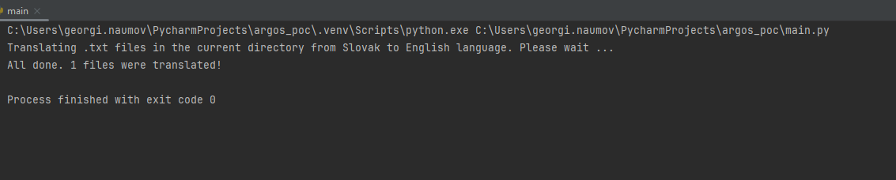

# Argos library POC
This project is a simple POC how Argos library can be used to translate Slovak to English. 
It translates all .txt files in the directory where script is started from Slovak to English. 

## Here is how looks the usage

